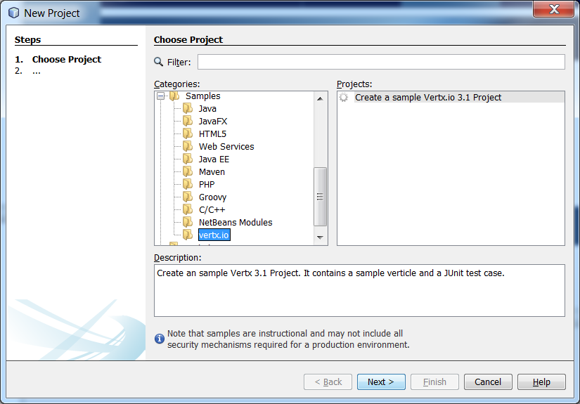
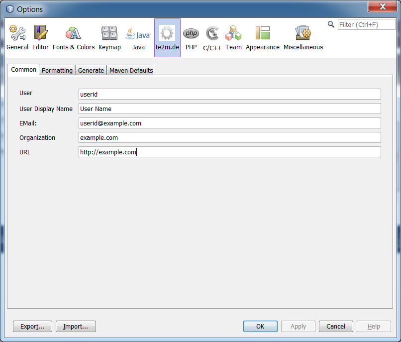

# te2m.de-netbeans
This repository contains several Netbeans Modules provided by te2m.de

## Modules

### de.te2m.tools.netbeans.vertx

Provides project templates and several code templates related to vertx.io. The generated code can be customized.

#### Features

##### Create an new (empty) Maven based project

##### Create an Maven based Sample Project

##### New File Wizards

##### Add code snippets via "Insert Code"

##### Add code snippets via "Palette"

##### Customize Code Generation via Options

### de.te2m.tools.netbeans.jsfutils

Provides code templates for JSF 2.x and PrimeFaces

#### Features

##### New File Wizards 

##### Add PrimeFaces components via "Insert Code"

##### Add PrimeFaces components via "Palette"

### VertxProjectTemplate

This is just the content of the initial vertx.io project created with the de.te2m.tools.netbeans.vertx module.

## About te2m.de

This project has initially started on SourceForge as part of [temtools](http://temtools.sf.net) in 2009. 
